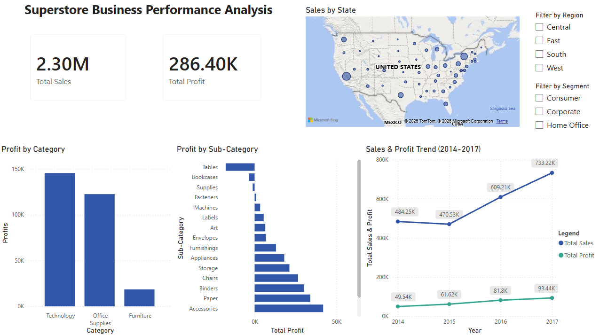

# Superstore Business Performance SQL Analysis

End-to-end retail sales analysis using MySQL and Power BI that covers
data ingestion, cleaning, SQL-based business insight 
queries, and an interactive dashboard.

## Project Goal
Analyze four years of retail superstore sales data to identify
profitability drivers, underperforming segments, and regional
growth opportunities to ultimately communicate findings
through an interactive Power BI dashboard.

## Tools & Technologies
- **MySQL** — data ingestion, cleaning, and analysis
- **MySQL Workbench** — query development environment
- **Power BI** — interactive dashboard and data visualization
- **GitHub** — version control and project documentation

## Data
Sample retail superstore dataset via Kaggle — includes order data, 
product categories, regional sales, customer segments, and profit margins.

- **Source:** Superstore Sales Dataset via Kaggle  
  (kaggle.com/datasets/vivek468/superstore-dataset-final)
- **Size** 9,994 orders across 21 columns
- **Coverage:** January 2014 – December 2017
- **Fields:** Order details, customer info, product categories, 
  regional data, sales, discounts, and profit

## Key Questions Explored
- Which product categories and subcategories are most and least profitable?
- Which regions and states are underperforming relative to sales volume?
- What customer segments drive the most revenue and profit?
- Where are the biggest opportunities to reduce costs or improve margins?

## Key Findings
- **Furniture is significantly UNDERperforming** - Furniture had 742,000 sales, which is similar to Technology and Office Supplies sales, BUT ONLY 2.49% profit margin VS. 17.4% for Technology and 17.0% for Office supplies.
- **Tables are a significant cause of profit loss, followed by Bookcases** - Tables (Furniture) generated significant NEGATIVE total profit of -$17,725.59, followed by Bookcases (Furniture) NEGATIE total profit of -$3472.56, dragging down the entire Furniture category.
- **The West region leads in BOTH sales and profit** - West had highest sales AND profit, whereas Central had the weakest profit margin despite moderate sales volume.
- **Heavy discounting correlates with NEGATIVE profit** - Total profits go from positive to negative on orders with 30% discount, with significant losses in profit margin from 50% discount (-35.71% profit margin) to 60% discount (-89.46% profit margin) and 70% discount (-98.66% profit margin) to 80% discount (-180.03% profit margin).
- **TOP 5 states by profit** - 1) California 2) New York 3) Washington 4) Michigan 5) Virginia
- **BOTTOM 5 states by profit** - 1) Texas 2) Ohio 3) Pennsylvania 4) Illinois 5) North Carolina

## Dashboard Preview

## How to Reproduce
1. Download the dataset from  
   kaggle.com/datasets/vivek468/superstore-dataset-final
2. Run scripts in order:  
   01 → 02 → 03 → 04
3. Open "dashboard/05_dashboard_superstore.pbix" in Power BI

**Note:** Use `LOAD DATA INFILE` with `CHARACTER SET latin1` for import. The MySQL Table Data Import Wizard causes column misalignment and corrupts certain column values.

## Author
Michael Pham
github.com/michaelapham
linkedin.com/in/michaelapham99
